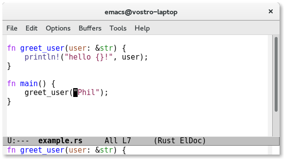

# *Racer* - code completion for [Rust](http://www.rust-lang.org/)

[](https://travis-ci.org/phildawes/racer)




*RACER* = *R*ust *A*uto-*C*omplete-*er*. A utility intended to provide rust code completion for editors and IDEs. Maybe one day the 'er' bit will be exploring + refactoring or something.

## Installation

1. ```cd racer; cargo build --release```.  The binary will now be in ```./target/release/racer```

2. Fetch the rust sourcecode from git, or download from https://www.rust-lang.org/install.html

3. Set the ```RUST_SRC_PATH``` env variable to point to the 'src' dir in the rust source installation

   (e.g. ```% export RUST_SRC_PATH=/usr/local/src/rust/src``` )

4. Test on the command line:

   ```./target/release/racer complete std::io::B ```  (should show some completions)


## Emacs integration

1. Install emacs 24.

2. Allow Emacs to install packages from MELPA:

   ```
   (require 'package)
   (add-to-list 'package-archives '("melpa" . "http://melpa.milkbox.net/packages/"))
   ```

2. Install racer: ```M-x package-list``` Find the racer package and install it

3. If racer is not in the path, configure emacs to find your racer binary and rust source directory
   ```
   (setq racer-cmd "<path-to-racer-srcdir>/target/release/racer")
   (setq racer-rust-src-path "<path-to-rust-srcdir>/src/")
   ```

4. Configure Emacs to activate racer and setup some key bindings when rust-mode starts:

   ```
   (add-hook 'rust-mode-hook 
	  '(lambda () 
	     (racer-activate)
	     (racer-turn-on-eldoc)
	     (local-set-key (kbd "M-.") #'racer-find-definition)
	     (local-set-key (kbd "TAB") #'racer-complete-or-indent)))
   ```

5. Open a rust file and try typing ```use std::io::B``` and press \<tab\>

6. Place your cursor over a symbol and hit M-. to jump to the
definition.

## Vim integration

1. Install using Pathogen, Vundle or NeoBundle. Or, copy racer/plugin/racer.vim into your .vim/plugin directory.

  Vundle users:
  ```
  Plugin 'phildawes/racer'
  ```

  NeoBundle users:
  ```
  NeoBundle 'phildawes/racer', {
  \   'build' : {
  \     'mac': 'cargo build --release',
  \     'unix': 'cargo build --release',
  \   }
  \ }
  ```

2. Add g:racer_cmd and $RUST_SRC_PATH variables to your .vimrc. Also it's worth turning on 'hidden' mode for buffers otherwise you need to save the current buffer every time you do a goto-definition. E.g.:

     ```
     set hidden
     let g:racer_cmd = "<path-to-racer>/target/release/racer"
     let $RUST_SRC_PATH="<path-to-rust-srcdir>/src/"
     ```

3. In insert mode use C-x-C-o to search for completions

4. In normal mode type 'gd' to go to a definition

## Kate integration

The Kate community maintains a [plugin](http://quickgit.kde.org/?p=kate.git&a=tree&&f=addons%2Frustcompletion). It will be bundled with future releases of Kate (read more [here](https://blogs.kde.org/2015/05/22/updates-kates-rust-plugin-syntax-highlighting-and-rust-source-mime-type)).

1. Enable 'Rust code completion' in the plugin list in the Kate config dialog

2. On the new 'Rust code completion' dialog page, make sure 'Racer command' and 'Rust source tree location' are set correctly
